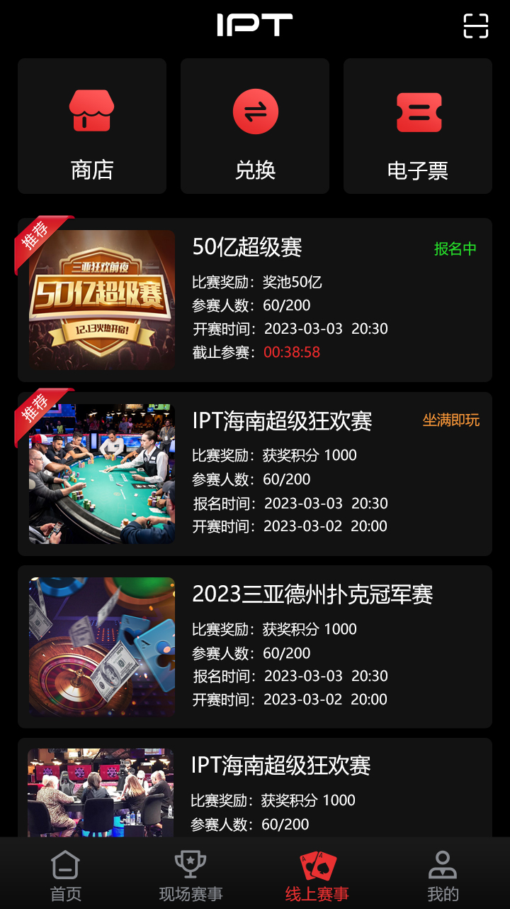
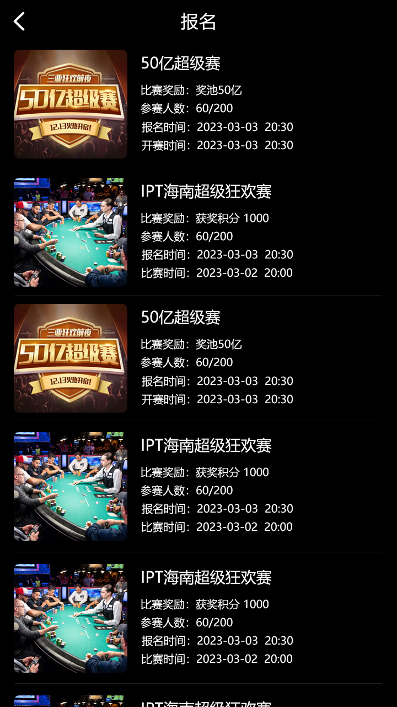
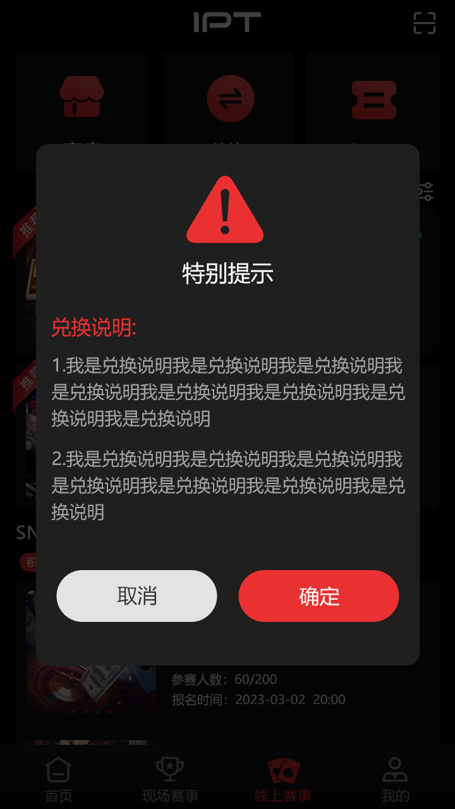
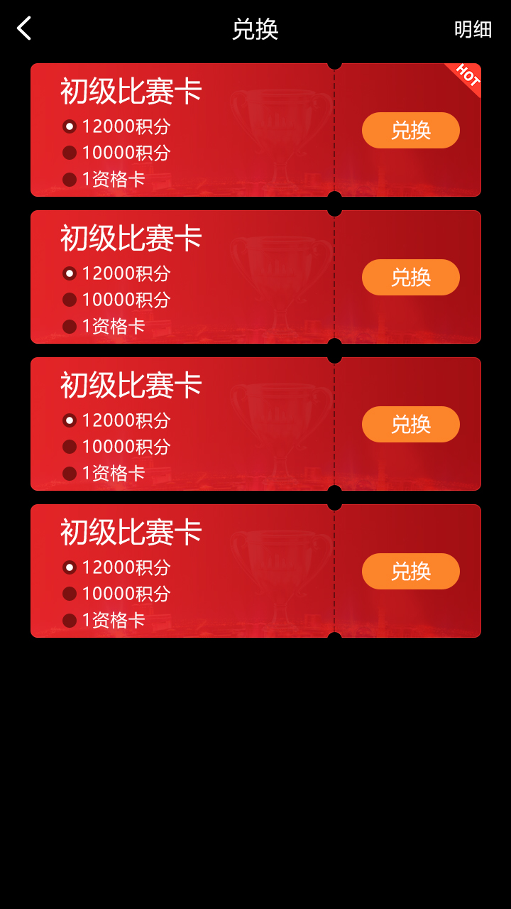
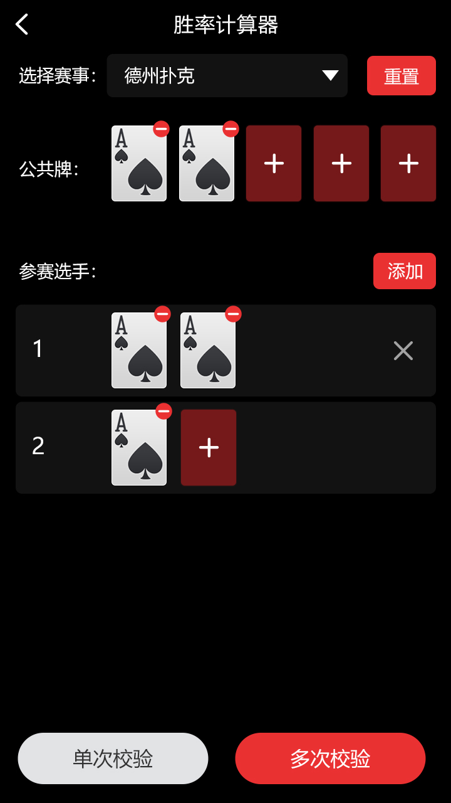

[简体中文](README.md) | [繁體中文](README.zh-TW.md) | [English](README.en.md) | [Visual site](https://masterai-top.github.io/Texas-Holdem-Poker-Platform-Source-Code/en/)

# Texas Holdem Online Tournament Platform Source Code

Source and product assets for online competitions, tournament registration and entry-benefit exchange. The repository combines C++ room/table hooks, Tars contracts, MySQL/Protobuf build dependencies, Unity UI components, hand-rank animation assets and authentic interface screenshots.

> This is a code and asset collection, not a verified turnkey client, event administration suite or hotel-booking system. Validate scope, dependencies, licensing and compliance against the actual delivery.

## Product capabilities

- Event home and online tournament discovery.
- Tournament details, registration and entry-benefit exchange screens.
- Player login, room entry, sit-down, offline and leave-table hooks.
- Game configuration, start checks, dealer selection, turn timers and end-game entry points.
- Unity scrolling/audio components plus hand-rank, countdown and progress assets.

## Player and game flow

Sign in → browse online events → review conditions → register or exchange eligibility → enter a room → server processes seating and game start → timers advance phases and broadcast state → end and clean the table. Verify the complete tournament-admin and result modules separately.

## Product screenshots

| Event home | Online tournaments | Registration |
| --- | --- | --- |
|  |  |  |

| Entry benefits | Exchange detail | Odds tool |
| --- | --- | --- |
|  |  |  |

## Technical structure

| Layer | Repository evidence |
| --- | --- |
| Server | C++ room/game hooks, GMServer, user state and timers |
| Framework | Tars Application, proxies and `.tars` common contracts |
| Messages | Protobuf references and client/room message delivery |
| Data | Tars MySQL client and configuration loading |
| Client assets | Unity C# components and PNG/Atlas/JSON animations |
| Utilities | GeoLite2 lookup, SMTP/cURL and SHA1/HMAC helpers |

## Build requirements

The Makefile builds `GMServer` and depends on Tars, WBL, RapidJSON, Protobuf, MySQL and several `/home/tarsproto/XGame/` modules not included here. A standalone `make` is not a complete deployment. Audit dependency versions, configuration, databases and contracts before building in an isolated environment.

## Contact and due diligence

Telegram: [@xuzongbin001](https://t.me/xuzongbin001) · Email: masterai918@gmail.com

Review the demo, source scope, third-party licenses, fairness and applicable laws before use. No concurrency, deployment, revenue or search-ranking outcome is guaranteed.

